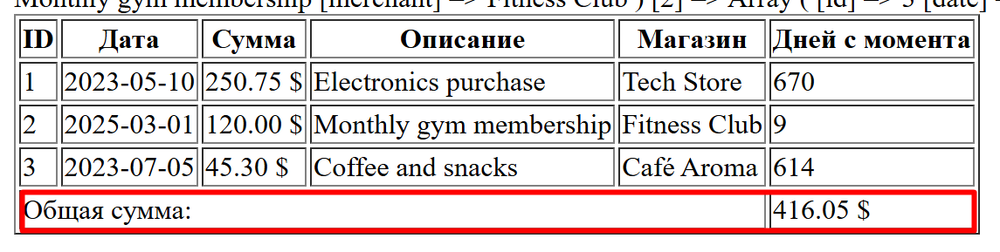
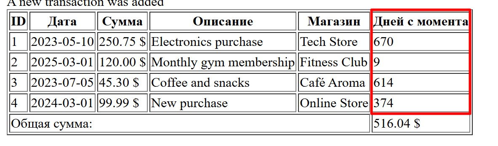
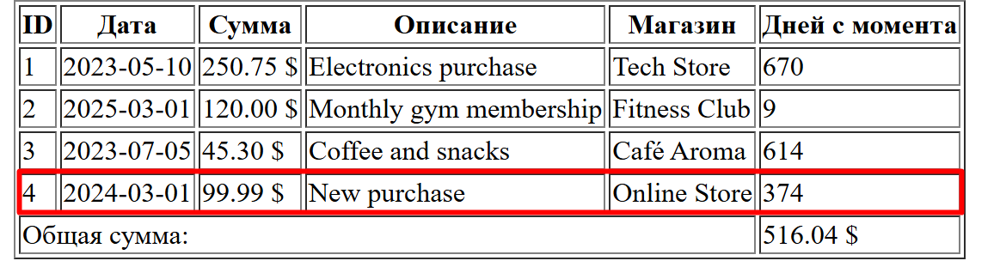

# Лабораторная работа №3. Массивы и Функции

## Студент
**Gachayev Dmitrii I2302**  
**Выполнено 10.03.2025**  

## Цель работы
Освоить работу с массивами в PHP, применяя различные операции: создание, добавление, удаление, сортировка и поиск. Закрепить навыки работы с функциями, включая передачу аргументов, возвращаемые значения и анонимные функции.
## 1. Работа с массивами.
Необходимо разработать систему управления банковскими транзакциями с возможностью:
- добавления новых транзакций;
- удаления транзакций;
- сортировки транзакций по дате или сумме;
- поиска транзакций по описанию.
## Выполнение
### 1.1 Подготовка среды
Создаю новый php файл `index.php`, включаю строгую типизацию:
```php
<?php

declare(strict_types=1);
```
### 1.2 Создание массива студентов.

Создаю массив $transactions, содержащий информацию о банковских транзакциях. Каждая транзакция представлена в виде ассоциативного массива с полями:

- `id` – уникальный идентификатор транзакции;
- `date` – дата совершения транзакции (YYYY-MM-DD);
- `amount` – сумма транзакции;
- `description` – описание назначения платежа;
- `merchant` – название организации, получившей платеж.

Массив `$transactions`:

```php
$transactions = [
    [
        "id" => 1,
        "date" => "2023-05-10",
        "amount" => 250.75,
        "description" => "Electronics purchase",
        "merchant" => "Tech Store",
    ],
    [
        "id" => 2,
        "date" => "2023-06-22",
        "amount" => 120.00,
        "description" => "Monthly gym membership",
        "merchant" => "Fitness Club",
    ],
    [
        "id" => 3,
        "date" => "2023-07-05",
        "amount" => 45.30,
        "description" => "Coffee and snacks",
        "merchant" => "Café Aroma",
    ],
];
```
### 1.3 Вывод списка транзакций.

Использую foreach, чтобы вывести список студентов в HTML-таблице:

*В следующих пунктах таблица будет изменена для удовлетворения других условий (например, добавления столбца с общей суммой)*

```php
<table border='1'>
    <thead>
        <tr>
            <th>ID</th>
            <th>Дата</th>
            <th>Сумма</th>
            <th>Описание</th>
            <th>Магазинн</th>
        </tr>
    </thead>
    <tbody>
    <?php foreach ($transactions as $transaction) { ?>
        <tr>
            <td><?= $transaction["id"] ?></td>
            <td><?= $transaction["date"] ?></td>
            <td><?= number_format($transaction["amount"], 2) ?> $</td>
            <td><?= $transaction["description"] ?></td>
            <td><?= $transaction["merchant"] ?></td>
        </tr>
    <?php } ?>
</tbody>
</table>

```

### 1.4 Реализация функций.
`calculateTotalAmount(array $transactions): float`:

```php
function calculateTotalAmount(array $transactions): float {
    $total = 0;
    foreach ($transactions as $transaction) {
        $total += $transaction["amount"];
    }
    return $total;
}
```

Проверить ее можно по выводу общей суммы в таблице:



В таблицу интегрировал так:

```php
 <td><?= calculateTotalAmount($transactions) ?> $</td>
```

`findTransactionByDescription(string $descriptionPart)`:

```php
function findTransactionByDescription(string $descriptionPart) {
    global $transactions;
    foreach ($transactions as $transaction) {
        if (strpos($transaction["description"], $descriptionPart) !== false) {
            return $transaction;
        }
    }
    return null;
}
```

В `index.php` сделал проверку для функции:


```php
$searchResult = findTransactionByDescription("Coffee");
if ($searchResult) {
    echo  "1. findTransactionByDescription is called <br>" . print_r($searchResult, true) . "<br>";
} else {
    echo "i did something wrong in findTransactionByDescription)<br>";
}
```

До таблицы должен выводиться текст и инфа о транзакции.

`findTransactionById(int $id)`:

```PHP
function findTransactionById(int $id) {
    global $transactions;
    foreach ($transactions as $transaction) {
        if ($transaction["id"] === $id) {
            return $transaction;
        }
    }
    return null;
}
```
Также добавил проверку до таблицы:

```php
$searchById = findTransactionById(2);
if ($searchById) {
    echo "2. findTransactionById is called <br>" . print_r($searchById, true)."<br>";
} else {
    echo "mistakes were made in findTransactionById <br>";
}
```
Должен выводиться текст и инфа о транзакции.

`daysSinceTransaction(string $date): int`:

```php
function daysSinceTransaction(string $date): int {
    $transactionDate = new DateTime($date);
    $today = new DateTime();
    $interval = $transactionDate->diff($today);
    return $interval->days;
}
```

Проверить можно по столбцу в таблице:



В таблицу интегрировал так:

```php
 <td><?= daysSinceTransaction($transaction["date"]) ?></td>
```

`addTransaction(int $id, string $date, float $amount, string $description, string $merchant): void`:

```php
function addTransaction(int $id, string $date, float $amount, string $description, string $merchant): void {
    global $transactions;
    $transactions[] = [
        "id" => $id,
        "date" => $date,
        "amount" => $amount,
        "description" => $description,
        "merchant" => $merchant,
    ];
}
```

Проверить можно по таблице, в ней появится добавленная транзакция:




